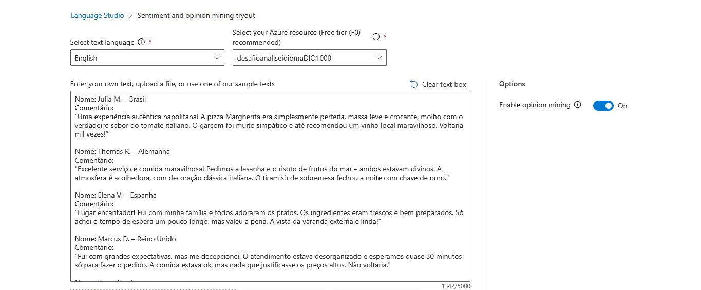
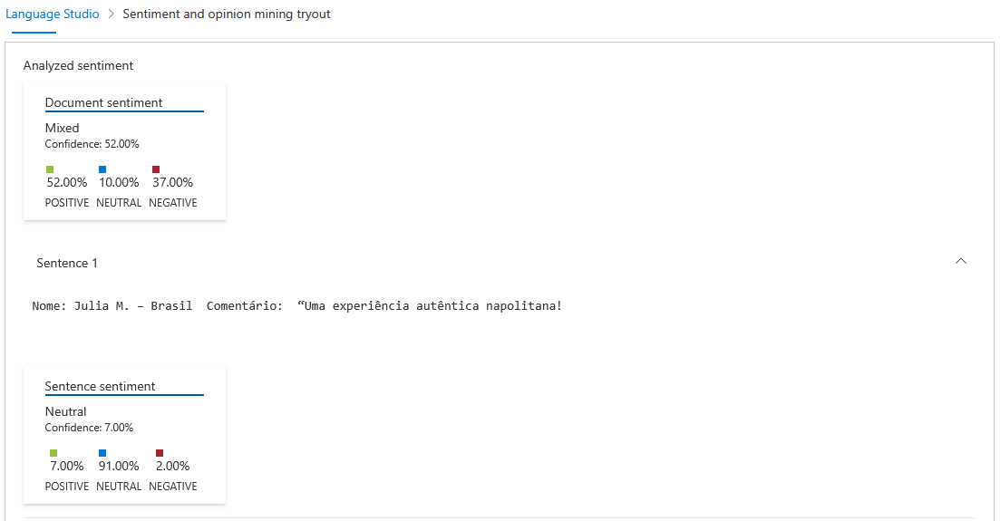
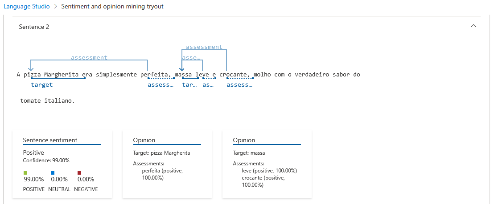
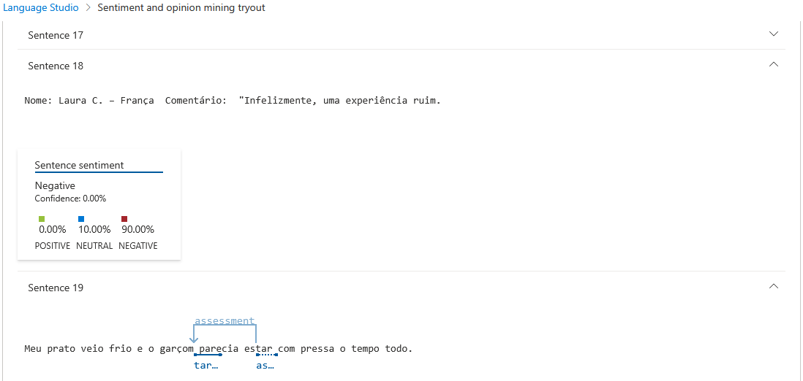

# Análise de Sentimentos com Language Studio no Azure AI

## Autor:
Renato Freitas da Silveira
## Contatos:

## Introdução
Este arquivo apresenta um resumo sobre os aprendizados relacionados ao desafio de fazer análise de sentimentos com o Language Studio do Azure AI.

## Requisitos
- Acesso a uma conta do Microsoft Azure
- Ter um computador

## Laboratório de Language Studio
O Language Studio é uma plataforma de ferramentas baseada em interface do usuário (UI) da Azure, que ajuda a analisar e classifar textos. Com essa ferramenta é possível identificar os sentimentos predominantes em um texto por meio da análise de palavras-chave.

Para utilizar essa ferramenta, primeiro devemos acessar o [https://portal.azure.com](https://portal.azure.com) (faça login na sua conta Microsoft caso seja requisitado). Clique no botão de Mostrar menu no canto superior esquerdo da página inicial e clique em Criar um novo recurso. Em Categorias, escolha AI + Machine Learning e selecione o Serviço de Linguagem. Após clicar em Continue to create your resource, irá aparecer uma tela com um formulário. Por padrão, os campos de Assinatura e Região já estarão preenchidos com, respectivamente, a sua assinatura da conta e East US. Escolha um Grupo de recursos já existente ou crie um novo, e dê um nome qualquer para seu recurso. No campo Tipo de preço, escolha Free F0. Marque a caixa de "declaro que analisei e confirmo os termos no Aviso de Uso Responsável da IA" e clique no botão Examinar + Criar. Será feita uma análise para validar os campos preenchidos e verificar se há crédito na assinatura. Caso a análise termine com sucesso, clique no botão Criar (ou Create) para finalizar o processo de criação.

Nesse próximo passo, devemos acessar o [https://language.cognitive.azure.com](https://language.cognitive.azure.com). Caso necessário, faça login nesse site também com a mesma conta. Aparecerá um formulário com vários campos já preenchidos. Em Resource name, escolha o nome do recurso criado e clique em Done. Na página inicial, escolha Classify text e clique em Analyse sentiment and mine opinions. Se tudo der certo até aqui, você verá um formulário com dois campos já preenchidos, Select language e Select your Azure resource, e uma grande caixa de texto com capacidade para 5000 caracteres. Nessa caixa de texto é onde escrevemos qualquer coisa para a ferramenta analisar, geralmente uma ou várias opiniões curtas sobre um serviço. Também é possível, abaixo da caixa de texto, inserir um arquivo txt para preencher automaticamente.

Como é possível ver na imagem acima, foi feito o upload de um arquivo chamado inputs.txt, que contêm cinco reviews de um restaurante fictício em Nápoles gerados por IA. Esse arquivo tem tanto reviews positivas quanto negativas. Com a caixa de texto preenchida, basta clicar no botão Run.

## Resultados
A imagem a seguir ilustra alguns resultados obtidos.

Na primeira imagem de resultados, é possível ver a análise do documento como um todo, ou seja, dos cinco reviews em inputs.txt. O Language Studio constatou que as cinco reviews são 52% positivas, 37% negativas e 10% neutras, e classificou o sentimento como misto. Ainda na imagem 1, verifica-se que a ferramenta analisou apenas a sentença 1 (de fato, o Language Studio analisa o texto como um todo e cada sentença), e classificou o sentimento dessa sentença como neutro.

Nas duas imagens abaixo há outras classificações feitas pelo Language Studio. A sentença 2, por exemplo, foi classificada como sentimento positivo e, além disso, foi extraído duas opiniões: pizza margherita perfeita e massa leve e crocante.

## Conclusões
Com base nos resultados obtidos pelo Language Studio, é possível extrair os seguintes insighs:
- A maioria das avaliações tem um tom positivo, porém dois dos cinco clientes, Marcus D. e Laura C. tiveram experiências muito negativas. É possível focar os problemas desses dois clientes em atendimento desorganizado e preços altos.
- Como o sentimento geral das cinco reviews foi classificado como misto, nota-se uma polarização entre as avaliações.
- O restaurante tem como principais pontos fortes a comida de alta qualidade, o atendimento simpático e o ambiente acolhedor. Já os pontos fracos são problemas de atendimento, inconsistência na qualidade do serviço, preços abusivos e tempo de espera muito longo.
- Algumas recomendações que esse restaurante pode seguir são: melhorar a consistência da qualidade do serviço por meio de treinamento para a equipe, comunicar claramente os tempos de espera, principalmente em dias mais movimentados, ou justificar os preços dos produtos com a qualidade dos igredientes, e por fim destacar os pontos fortes do restaurante, como promover a pizza margherita.